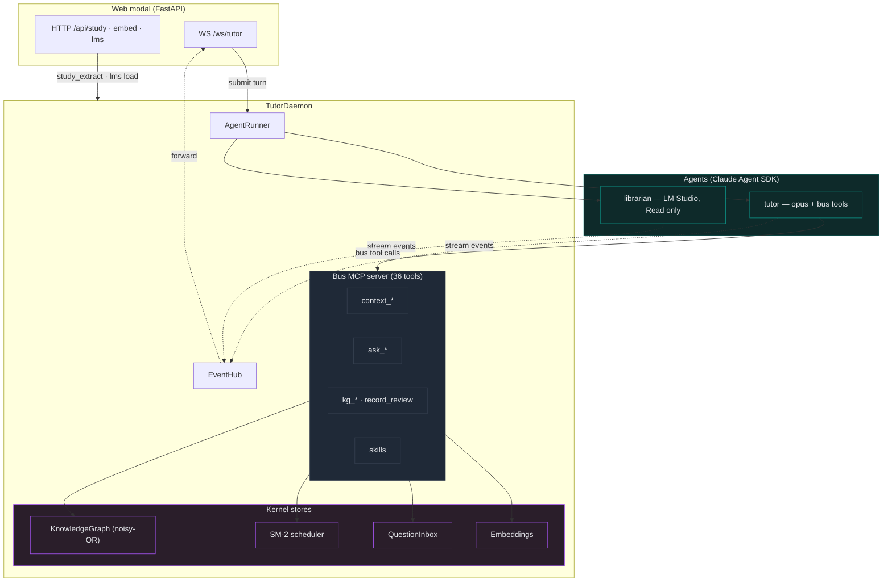
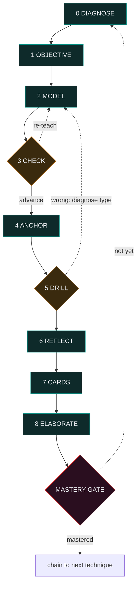
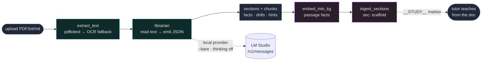
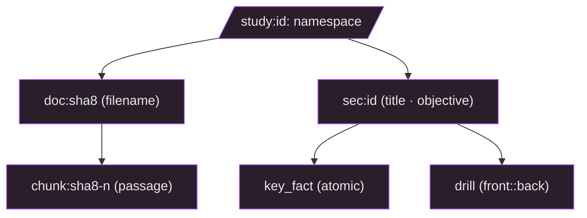

# Diagrams

Source-of-truth Mermaid for the architecture, the lesson loop, and the
study-project flow. GitHub renders the fenced ` ```mermaid ` blocks inline;
the README embeds a subset of these.

The tutor itself teaches via Mermaid diagrams — so this is also the project's
native diagram format.

---

## 1. Architecture — how the tutor composes the kernel

`TutorDaemon` wires the [`salient-core`](https://github.com/baggybin/salient-core)
coordination kernel into a teaching agent. The **bus MCP server** is the
connective tissue: it binds the daemon as the tool backend, so every bus tool
the tutor calls routes back into the knowledge graph, the SM-2 scheduler, and
the operator inbox living inside the daemon.



**Key idea:** SM-2 is not a separate store. `record_review(topic, grade)` is a
bus tool that runs the scheduling functions
(`next_interval_days`, `next_mastery`) and writes the result back into the
knowledge graph under the `learner:op` subject — so the gradebook and the
scheduler share one source of truth.

---

## 2. The 9-phase LESSON LOOP

Every lesson runs the same nine phases (numbered 0–8 in the prompt). Two are
decision points: **CHECK** branches on whether the learner advanced, and
**DRILL** branches on the type of error. The loop does not exit until the
**mastery gate** is met — the current technique demonstrated at the *Apply*
Bloom level in a fresh case.



CHECK and DRILL are the two decision points: each can loop back to MODEL
(re-teach). The loop only exits the MASTERY GATE — current technique shown at
the Apply Bloom level in a fresh case.

The phases in detail (verbatim from the prompt):

| # | Phase | What happens here |
|---|---|---|
| **0** | **DIAGNOSE** | Pull the learner profile (`kg_query("learner:op")`) for weak topics, misconceptions, last drill outcomes. One probing question. After the first lesson, a retrieval warm-up. |
| **1** | **OBJECTIVE** | State the one thing they'll be able to DO, in ATT&CK / kill-chain terms. |
| **2** | **MODEL** | A worked example: reasoning walked aloud + a Mermaid diagram. One new idea. |
| **3** | **CHECK** | A Socratic question testing the WHY (not recall). The answer decides advance vs re-teach. |
| **4** | **ANCHOR** | Lock the key fact into long-term memory; have them walk it blind immediately. Mnemonic for arbitrary facts, clean recall otherwise. |
| **5** | **DRILL** | Deliberate practice with faded scaffolding. On a wrong answer, diagnose the error type (Structural / Deviation / Application / Metacognitive) before remediating. Records `record_review(topic, grade)`. |
| **6** | **REFLECT** | Self-rate + name the next gap; state the Bloom level hit. |
| **7** | **CARDS** | Mint 2–4 spaced-repetition flashcards, biased to what was hardest. |
| **8** | **ELABORATE** | Connect to neighbouring techniques and the broader principle. |

The error-type remediations at DRILL (Structural / Deviation / Application /
Metacognitive) each loop back to MODEL with a different re-teaching strategy.

---

## 3. Study-project flow — upload → extract → teach

The librarian is a one-shot extractor: read one document, emit one JSON block.
Pre-extracting the document to plain text (pdftotext, with an OCR fallback)
means *any* model can parse it — not just vision-capable ones. The librarian
runs either on Claude or on a local LM Studio endpoint, while the tutor always
stays on Claude.



What lands in the knowledge graph under `study:<id>:`:



---

## 4. Request flow — chat path vs study path

Two independent paths through the daemon. The **chat path** streams a tutor
turn live over the websocket; the **study path** runs a synchronous
extraction within an HTTP request. Both touch the same kernel stores.

```mermaid
sequenceDiagram
    autonumber
    participant U as Browser
    participant W as FastAPI
    participant D as TutorDaemon
    participant T as tutor agent
    participant K as KnowledgeGraph
    participant L as librarian

    rect rgb(14, 42, 42)
        Note over U,L: Chat path — streaming lesson turn (WS /ws/tutor)
        U->>W: {cmd:"prompt", message}
        W->>D: runner.submit(text)
        D->>T: run LESSON LOOP
        T->>K: kg_query(learner:op)
        T->>K: record_review(topic, grade)
        T-->>W: thinking · tool-call · text (events)
        W-->>U: stream over WS (live)
    end

    rect rgb(42, 30, 14)
        Note over U,L: Study path — document extraction (HTTP /api/study/…/extract)
        U->>W: POST extract {doc_sha}
        W->>D: study_extract(id, sha)
        D->>D: extract_text (pdftotext / OCR)
        D->>L: prompt("librarian", text + contract)
        L-->>D: {status, sections, chunks}
        D->>K: embed_into_kg + ingest_sections
        D-->>W: {status:"extracted", sections}
        W-->>U: HTTP response
    end
```



The librarian (study path) and tutor (chat path) share the knowledge graph but
otherwise don't interact at runtime — the librarian is invoked directly by the
daemon for extraction, not delegated to by the tutor.
